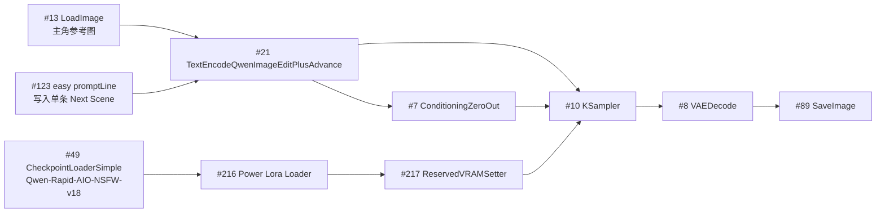

# Stage 05 Qwen 本地工作流运行原理图谱

## 目的

这份图谱只回答三件事：

1. 两条本地 Qwen 工作流各自到底在做什么
2. 为什么 `AI漫剧-16宫格分镜图生成-QwenEdit+NextScene（自动分镜）-V1版.json` 更适合 Stage 05 主流程
3. 后续代理在调用时，哪些节点能动，哪些节点不能乱动

它不是创意说明书，而是 **运行原理 + 调用边界 + 误用警戒线**。

## Stage 05 真正要的不是“多图”，而是“可衔接的单帧”

Stage 05 在本仓库里的真实产物不是 contact sheet，也不是试镜头素材包，而是：

- `05_images/keyframes/S001_start.png`
- `05_images/keyframes/S001_end.png`
- `...`

因此判断一个工作流是否适合 Stage 05 主流程，优先看：

1. 能不能稳定吃进 `单主角参考图`
2. 能不能稳定吃进 `Stage 04 已确认的单镜头 prompt`
3. 能不能稳定吐出 `单张关键帧`
4. 这张关键帧能不能继续喂给 Stage 06 的 `single_subject_motion`

## 候选工作流 A

### 文件

- `F:/ComfyUI/ComfyUI/user/default/workflows/AI漫剧制作/AI漫剧-16宫格分镜图生成-QwenEdit+NextScene（自动分镜）-V1版.json`

### 主干图

### 节点角色

| 节点 | 作用 | Stage 05 是否允许直接注入 |
| --- | --- | --- |
| `#13 LoadImage` | 主角参考图入口 | 允许 |
| `#123 easy promptLine` | 主 prompt 入口 | 允许 |
| `#21 TextEncodeQwenImageEditPlusAdvance_lrzjason` | 把参考图和 prompt 一起编码成 edit conditioning + latent | 不直接改结构 |
| `#49 CheckpointLoaderSimple` | 基座模型 | 不在主流程里乱切 |
| `#216 Power Lora Loader` | `next-scene + 写实美学` LoRA 组合 | 不在主流程里乱切 |
| `#10 KSampler` | 真正采样节点 | 允许改 seed，不随意改其余采样策略 |
| `#8 VAEDecode` | latent 解码成图像 | 不动 |
| `#89 SaveImage` | 输出文件名前缀 | 允许 |

### 现有模型栈

- `Qwen\\Qwen-Rapid-AIO-NSFW-v18.safetensors`
- `Qwen\\next-scene_lora_v1-3000.safetensors`
- `Qwen\\WangMoon.v5美女.safetensors`
- `Qwen\\Kook_Qwen_V3极致真实.safetensors`

### 这条流为什么适合 Stage 05

因为它的真正主干是：

- `参考图进入 #13`
- `单条 shot prompt 进入 #123`
- `在 #21 汇合`
- `在 #10 单次采样`
- `从 #89 单张落图`

它不像“自动写剧情再出图”，更像：

- `参考图驱动的单镜头执行器`

这和 Stage 05 的主职责是一致的。

### 这条流最容易被错用的地方

虽然名字带着“16宫格 / 自动分镜”，但当前这版图里：

- 没看到可靠的逐镜批量循环主干
- `#123` 默认却塞了很多行 `Next Scene`

所以误用方式通常是：

1. 一次往 `#123` 塞很多行 prompt
2. 期待它稳定产出多张分镜
3. 最后得到一张语义混杂、人物飘、服装飘、镜头意图糊掉的图

**正确使用方式只有一个：单镜头执行模式。**

即：

- 一次任务只改一条 `Next Scene`
- 一次执行只服务一个 `Sxxx_start` 或 `Sxxx_end`
- 不把它当宫格图生成器

### 已核定的可注入节点

当前 repo 的映射键：

- `stage05_realistic_cinematic_qwen_edit_nextscene_local`

当前允许注入位：

| 字段 | 节点 |
| --- | --- |
| `positive_prompt` | `#123` widget `0` |
| `reference_image_path` | `#13` widget `0` |
| `seed` | `#10` widget `0` |
| `output_prefix` | `#89` widget `0` |

这些注入位的意义不是“这条流完全参数化”，而是：

- 对 Stage 05 主流程来说，当前只开放最少且必要的四个控制点
- 先锁住参考图、主 prompt、seed、输出路径
- 不让代理随意改内部编码、LoRA 栈和批量演示结构

## 候选工作流 B

### 文件

- `F:/ComfyUI/ComfyUI/user/default/workflows/AI漫剧制作/Qwen-Edit-2511-一键多角度，多场景分镜.json`

### 总体结构

```mermaid
flowchart TD
  subgraph U["上半支：1.单图出分镜图编辑1"]
    U1["#15 LoadImage"] --> U2["#19 图像缩放"]
    U3["#34 CR Prompt Text"] --> U5["#32 JWStringConcat"]
    U4["#35 Text Multiline<br/>基于参考图自动生成连续分镜规则"] --> U5
    U2 --> U6["#36 Qwen3_VQA"]
    U5 --> U6
    U6 --> U7["#197 Prompt_Edit"]
    U7 --> U8["#38 easy promptLine"]
    U8 --> U9["#20 TextEncodeQwenImageEditPlus"]
    U2 --> U9
    U9 --> U10["#21 ReferenceLatent 正面"]
    U11["#18 弱提示/空提示"] --> U12["#22 ReferenceLatent 负面"]
    U10 --> U13["#5 KSampler"]
    U12 --> U13
    U13 --> U14["#6 VAEDecode"] --> U15["#14 SaveImage"]
  end

  subgraph L["下半支：2.单图出多角度图编辑1"]
    L1["#137 LoadImage"] --> L2["#134 图像缩放"] --> L3["#132 VAEEncode"]
    L4["#141 easy promptLine<br/>前移/旋转/俯视/特写等机位变化"] --> L5["#117 TextEncodeQwenImageEditPlus"]
    L1 --> L5
    L6["#116 弱提示/空提示"] --> L7["#118 ReferenceLatent 负面"]
    L5 --> L8["#131 ReferenceLatent 正面"]
    L3 --> L8
    L3 --> L7
    L8 --> L9["#111 KSampler"]
    L7 --> L9
    L9 --> L10["#112 VAEDecode"] --> L11["#139 SaveImage"]
  end
```

### 上半支的真实含义

这条支路不是“手工指定镜头再执行”，而是：

1. `#36 Qwen3_VQA` 先看参考图
2. 再根据 `#35` 的系统规则自动扩写连续分镜文本
3. `#197 Prompt_Edit` 做中间编辑
4. `#38 easy promptLine` 再把自动写出的多条 `Next Scene` 喂给生成链

关键问题是：

- `#35` 明确要求基于参考图中的人物与环境
- 还明确要求剧情要在 **同一场景中** 连续展开

这和 Stage 05 的主流程目标不是一回事。

Stage 05 要的是：

- Stage 04 已确认 shot semantics
- 跨镜头甚至跨场景的人物一致性
- 逐镜单帧交付

而不是：

- 让工作流先自己写小剧本

### 下半支的真实含义

这条支路的重点是：

- 相机前移
- 左右平移
- 旋转
- 俯视 / 仰视
- 广角 / 特写

再叠一层：

- `Qwen\\Qwen-Edit-2509-Multiple-angles.safetensors`

它更像：

- 同主体、同场景下的多角度试镜器

适合 repair、机位探索、补角度，不适合直接当 Stage 05 正式主线。

## 两条流的职责分工

### 适合当 Stage 05 主流程基底

- `AI漫剧-16宫格分镜图生成-QwenEdit+NextScene（自动分镜）-V1版`

前提：

- 必须按 **单镜头执行模式**

### 只适合当辅助工作流

- `Qwen-Edit-2511-一键多角度，多场景分镜`

适用场景：

- 同场景机位试验
- 多角度补帧
- 局部 repair
- 给人工选镜头参考

### 不允许的误用

1. 用 `一键多角度，多场景分镜` 代替 Stage 04 编镜头
2. 用 `16宫格+NextScene` 一次塞很多条 prompt 期待稳定批量产图
3. 在主流程里让工作流自由生成剧情分镜
4. 把 Stage 05 做成 contact sheet 再回头挑图

## 与 Stage 06 的衔接边界

这次选中的 Qwen 主流程只默认适配：

- `stage06_route_hint = single_subject_motion`

原因很直接：

- 它最擅长的是单主角、强参考图锚定、逐镜关键帧

它不该默认承担：

- 多人互动
- 强动作交接
- 必须额外补 `mid guide` 的复杂运动镜头

遇到这类镜头，正确策略是：

1. 拆 shot
2. 或改用别的 Stage 05 路线
3. 不要强行把这条 Qwen 参考图流塞给 Stage 06

## 未来代理调用规则

如果任务满足下面四个条件：

1. 单主角
2. 有明确主角参考图
3. Stage 04 已给出明确单镜头 prompt
4. 目标是继续进入 Stage 06

那么默认规则应当是：

1. 先读本文件
2. 再读 `stage05-qwen-reference-guided-workflow-rules.md`
3. 选择 `stage05_realistic_cinematic_qwen_edit_nextscene_local`
4. 只按单镜头执行模式调用
5. 只开放 `reference_image_path / positive_prompt / seed / output_prefix`

如果任务是：

- 想补角度
- 想找机位
- 想做 same-scene repair

才考虑调用：

- `Qwen-Edit-2511-一键多角度，多场景分镜.json`

而且把它明确标记为：

- `auxiliary_only`
